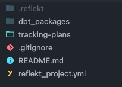

<!--
SPDX-FileCopyrightText: 2022 Gregory Clunies <greg@reflekt-ci.com>

SPDX-License-Identifier: Apache-2.0
-->

# Reflekt Project and Tracking Plan code

## Project
A Reflekt project is a directory of folders and files that define your tracking plans and any templated dbt packages based on those plans.



Every Reflekt project has a `reflekt_project.yml`, setting project wide configurations.
<br>

<details><summary>Example <code>reflekt_project.yml</code> (click to expand)</summary><p>

```yaml
# reflekt_project.yml

# Configurations are REQUIRED unless flagged by an '# OPTIONAL (optional_config:)' comment
# Uncomment OPTIONAL configurations to use them

name: default_project

config_profile: default_profile  # Profile defined in reflekt_config.yml

# OPTIONAL (config_path:)
# config_path: /absolute/path/to/reflekt_config.yml

tracking_plans:
  naming:  # Naming conventions for tracking plans
    events:
      case: title  # One of title|snake|camel
      allow_numbers: true
      reserved: []  # Reserved event names (casing matters)

    properties:
      case: snake  # One of title|snake|camel
      allow_numbers: true
      reserved: [] # Reserved property names (casing matters)

  data_types:
    # Specify allowed data types. Available types listed below
    allowed:
      - string
      - integer
      - boolean
      - number
      - object
      - array
      - any
      - 'null'  # Specify null type in quotes

  plan_schemas:
    # For each reflekt tracking plan, specify the schema in your data warehouse storing raw data.
    # Replace the example mapping below with your mappings
    example-plan: example_schema

  # OPTIONAL (metadata:)
  # Define a validation schema for your metadata. This is tested when running
  #     reflekt test --name <plan-name>
  # Uses Cerberus validation rules (https://bit.ly/3vIsAfs) to define schemas.
  metadata:
    schema:
      # Example metadata schema
      product_owner:
        type: string
        required: true
      code_owner:
        required: true
        type: string
      stakeholders:
        type: string
        required: false
        allowed:
          - Product
          - Engineering
          - Data

dbt:
  templater:
    sources:
      prefix: src_reflekt_       # Prefix for templated dbt package sources

    models:
      prefix: reflekt_           # Prefix for models & docs in templated dbt package
      materialized: incremental  # One of view|incremental
      # OPTIONAL (incremental_logic:) [REQUIRED if 'materialized: incremental']
      # Specify the incremental logic to use when templating dbt models.
      # Must include the  ...  block
      incremental_logic: |
        
        where received_at >= ( select max(received_at_tstamp)::date from {{ this }} )
        

    # OPTIONAL (package_schemas:)
    # For each tracking plan, specify schema where models in Reflekt dbt package will be materialized.
    # package_schemas:
    #   example-plan: example_schema

```
</p></details>

## Configuration
Similar to dbt, Reflekt uses a `reflekt_config.yml` file to specify how Reflekt should connect to your Analytics Governance Tool, CDP, and warehouse.

<details><summary>Example <code>reflekt_config.yml</code> (click to expand)</summary><p>

```yaml
my_config:
  plan_type: segment  # Plan in Segment Protocols
  cdp: segment
  workspace_name: my_workspace  # Only required for Segment Protocols plans
  access_token: abc123          # Only required for Segment Protocols plans
  warehouse:
    snowflake:
      account: xyz789
      database: raw
      password: my_password
      role: transformer
      user: reflekt_user
      warehouse: transforming
```
</p></details>

## Tracking plan
Reflekt manages your tracking plans in the `tracking-plans/` directory of your Reflekt project. Your events, identify traits, and group traits all have corresponding YAML files.


`plan.yml` holds the plan name (used by the reflekt CLI). You do not need to use/edit `plan.yml`.

## Events
Each event in your tracking plan has its own YAML file, making it easy to manage and update the spec for individual events. Importantly, these YAML files are *human readable*. No incomprehensible JSON here!

<details><summary>Example <code>product-added.yml</code> (click to expand)</summary><p>

```yaml
# product-added.yml
- version: 1
  name: Product Added
  description: Fired when a user adds a product to their cart.
  metadata:  # Set event metadata. Configure metadata tests in reflekt_project.yml
    product_owner: pm-name
    code_owner: eng-squad-1
    priority: 1
  properties:
    - name: cart_id
      description: Cart ID to which the product was added to.
      type: string
      required: true    # Specify property is required
    - name: product_id
      description: Database ID of the product being viewed.
      type: integer
      required: true
    - name: name
      description: Name of the product.
      type: string     # Specify property type
      required: true
    - name: variant
      description: Variant of the product (e.g. small, medium, large).
      type: string
      enum:            # Enumerated list of allowed values
        - small
        - medium
        - large
      required: false  # Property is not required
    - name: price
      description: Price ($) of the product added to the cart.
      type: number
      required: true
    - name: quantity
      description: Quantity of the product added to the cart.
      type: integer
      required: true
```
</p></details>

## Identify traits

## Group traits


